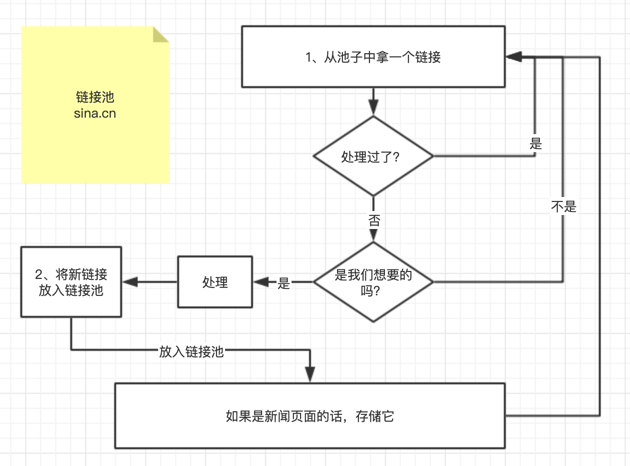

# 项目：多线程爬虫与Elasticsearch搜索引擎实战

***

## 一、项目概述：

- 1、项目目标：爬取新浪网
- 2、需求分析与算法设计：
    - 需求：网页中的一个节点开始遍历所有节点
    - 算法：使用了广度优先算法的变体
        

***

## 心得与收获：

### 1、做一个项目的原则

- 心法：
    - 1、把每个项目当作人生最好的项目来精雕细琢，一丝不苟滴写好文档，保证代码质量（以自己当前最高水平去完成，可以借助代码检测工具）
    - 2、使用业界标准化的模式和流程，每一行代码都不要是多余的（如：不要提交不该提交的文件 .idea 等不要上传到Github）；几乎不要有本地依赖，使用者能够毫无障碍的使用
    - 3、小步快跑，成就感，越小的变更越容易debug，越早进行越好
- 强制规范：
    - 1、【重要】使用GitHub+主干/分支模型进行开发
        - 禁止直接push master
        - 所有变更必须PR进行
    - 2、【重要】自动代码质量检查+测试
        - Checkstyle/SpotBugs
        - 最基本的自动化测试覆盖
- 项目设计流程
    - 多人协作【自顶向下】
        - 模块化
            - 各模块之间责任明确，界限清晰
            - 基本文档
            - 基本借口
        - 小步提交
            - 大的变更难以review
            - 的的变更更加棘手
            - 小步提交颗粒度
    - 单打独斗【自底向上】
        - 先实现功能
        - 在实现的过程中不断抽出公用的部分
            - 每当自己写的代码比较啰嗦（不断复制粘贴）的时候就得重构了
        - 通过重构实现模块化、接口化
- 项目演进：
    - 单线程 -> 多线程
    - console -> H2 -> MySQL
    - database -> Elasticsearch
- 好的代码习惯：
    - 不要写妥协的代码
    - 有好的三方实现可以借用，如：Apache提供的包

### 2、收获

- 冒烟测试；测试原则：每个测试是一个类，负责一个小的功能模块
- git命令回顾：
    - 撤销 git add 操作，可以使用以下命令：
      ```shell
        git restore --staged src/main/java/com/github/weiranyi/Main.java
      ```
    - 若此时全部commit提交，想要撤销一个提交怎么办
      ```shell
        git reset HEAD~1
      ```
    - 撤销PR的提交
      ```shell
      git log --获得61b22195162ec24fbbf2ef020485bb0a524c82b9
      git revert 61b22195162ec24fbbf2ef020485bb0a524c82b9
      ```
    - 若在自己分支出现与master冲突时，可以通过force push
        ```shell
        git push -f
        ```
- commit提交文本，首行做标题行，第二行开始写内容，每行最好不要超过72个字符
- 使用了circleci检查，比自己发现代码问题还要细致
- 算法
    - DFS 深度优先算法
    - BFS 广度优先


